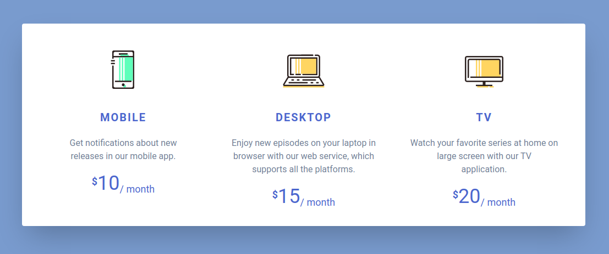

# Gadget-Loop1_Step1

GadgetLoop is an implementation of Gadgets UI with HTML/TailWindcss/CSS.

## Preview

## Getting started

clone or download this repository ,run the `index.html` with favourite browser.

## Prerequisite

Browser version must be recent for better experience.

## Tech/Framework Used

- HTML

- CSS
-   TailWindCSS

## Contact

You can reach me at <mubashir@codevillage.ng>

<asiyanbimubashir@gmail.com>

## Additional info

- One of the projects of code village Tailwind section.

- This project is implemented for learning purpose only.

## Author

### _*Asiyanbi Mubashir*_😎